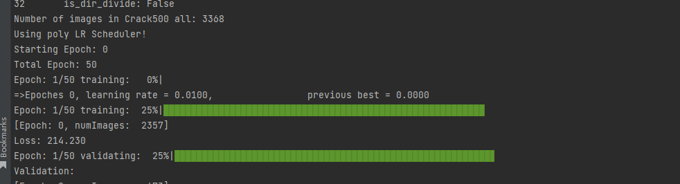

# Experiment 2 of the Computer Vision Course

## 简介

​	最近作为计算机视觉课程助教，需要为学生们准备的一个语义分割相关的小实验。主题是使用各类模型对道路裂纹进行语义分割，目的是让学生们理解端到端的深度学习模型处理过程、和语义分割任务的一些特点和难点。

## 实验操作步骤

### 配置环境

项目路径下的requirements.txt和requirements.yml分别是pip和conda导出的依赖包。选择其一进行环境配置即可。方法如下，在终端输入指定指令，可完成安装。遇到个别包安装失败时，可以手动安装。

```python
# requirements.txt
pip install -r requirements.txt
# requirements.yml
conda env create -f requirements.yml
```

### 设置路径

项目大部分地方使用的是相对路径，但为确保实验正常进行，建议在实验之前，更改顶层目录下的mypath.py中的类Pather的db_root_dir方法，用于指定对应数据集文件夹路径。

### 训练权重

运行train.py即可开始模型训练，目前项目已经提供了端到端的UNet和u2net模型和crack500数据集，以及SGD优化器。使用者可以自行添加新的模型，或者选择其他优化器，乃至数据集。在train.py脚本的get_args方法提供了一些可选参数。

```python  
# 使用u2net模型在crack500数据集训练20轮次
pyhton train.py --model u2net --dataset crack500 --epochs 20
```





### 其他

项目中使用了Tensorboard，可以在实时查看训练中间结果。
